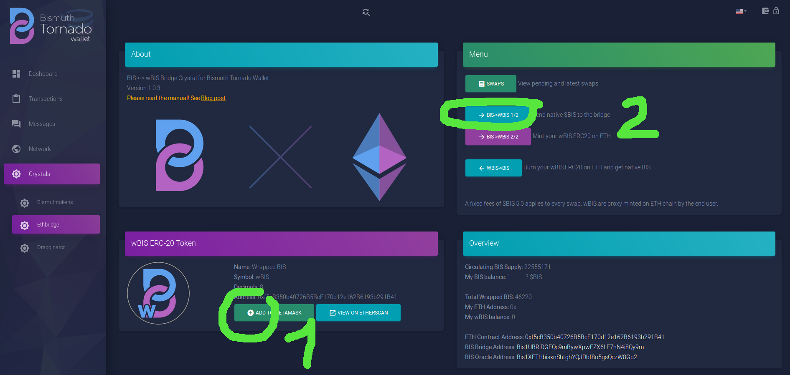

# BIS TO WBIS

Detailled step by step info in addition to the [Readme](README.md).

This supposes the EthBridge Crystal is activated and Wallet was restarted once.

## Step 1

Crystal is active (notice the B x ETH logo showing)

- Click "Add to Metamask" to setup the custom token with its logo
- click "BIS->WBIS 1/2" to go to the transfer page

## Step 2

- Enter your ETH address, the one that will receive the wBIS token
- Enter the amount in BIS. 5 BIS fees will be deducted. 10 BIS is the minimal transfer amount.
- Click "send Bis..." and validate the transaction
- Go to the "swaps" page to monitor the swap.

## Step 3

- Once mined, your BIS transfer will show up. Just wait for it to go through the confirmations,
 then for the mint to be signed.

 This can take a while depending on the timing and availability of the signers. **Just be patient**.  
 If your transaction is visible on the BIS chain, it will go through.

## Step 4

- Once signed, you'll get a new orange link to mint your wBIS yourself, click it.

## Step 5

You arrive on an already filled form.  
Do not change anything in the params, or your transaction will fail.  

- Check the default gas fees are correct. You are invited to check current recommended price on ethgasstation or a similar website.
- Proxy mint your wBIS
- Once the ETH transaction is validated, your wBIS balance is updated.

**DONE!** 

