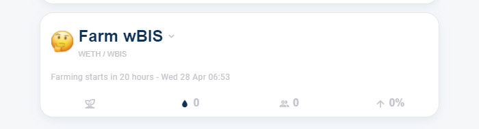
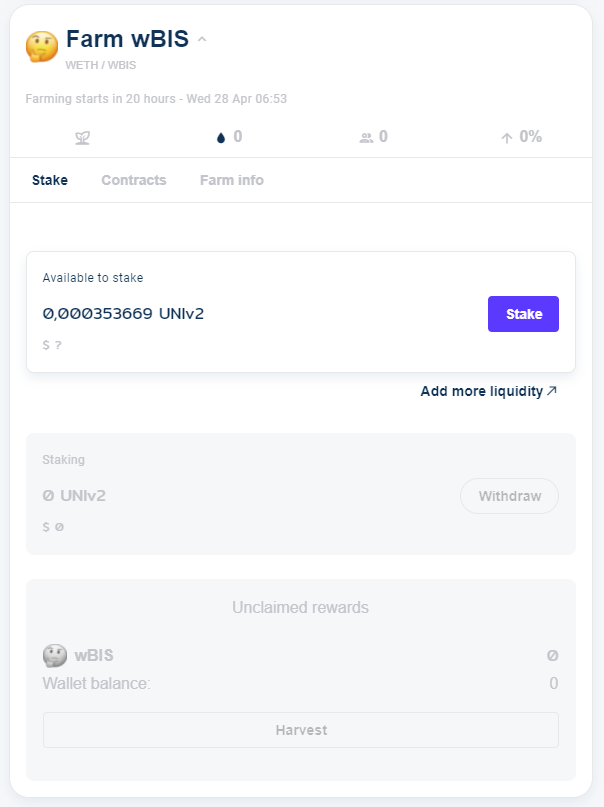
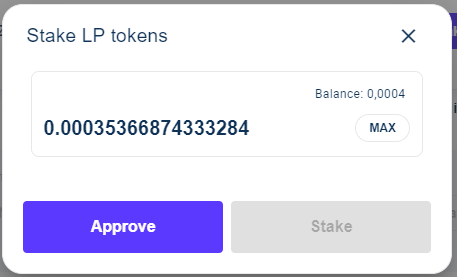
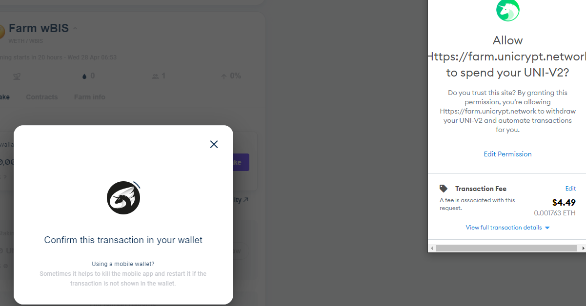
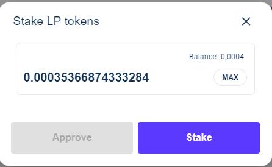
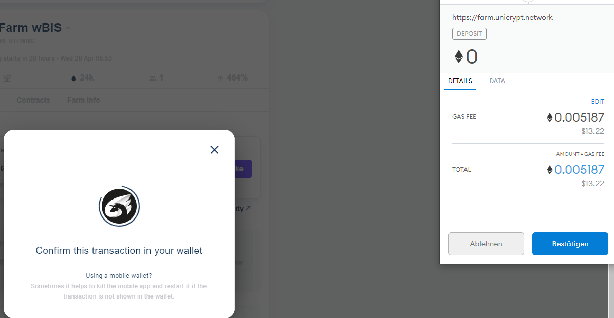
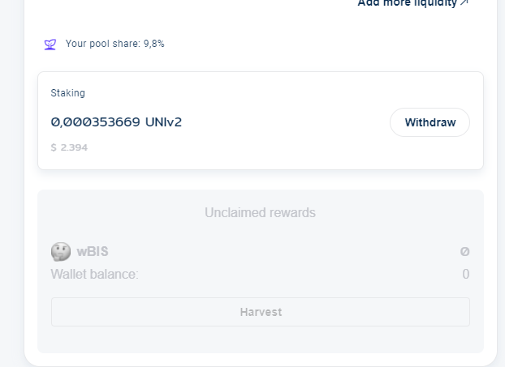

# Farming BIS as wBIS on Unicrypt farm

In this document you will find a short step-by-step guide to enter a farm on unicrypt to get rewarded for providing liquidity on the [eth/wBIS-Pool](https://info.uniswap.org/pair/0xf4f82f8d84c529987201609cecee8ab136a50c8c) on Uniswap.

First, head over to [Unicrypt farms](https://farm.unicrypt.network/farms) and search for the wBIS-farm:

You have to click through the pages to find it.

if you click on "Farm wBIS", the whole info drops down.

If not already done, click on "connect your wallet", for example Metamask. Select the account where your UniV2-LP-Tokens are located. If you connected the wallet it should show your LP-Tokens:

If you want to enter the farm, click "stake":

Click "max" to add all your LP-Tokens or fill in the amount of tokens you want to put in.

As a little warning: Your UniV2-LP-Tokens are sent to a smart contract and not in your wallet anymore. If you want to remove liquidity from the pool due to any reason, you first need to pull out your LP-Tokens from the farm (all or a part of them). So it can make sense to enter the farm only with a part of the LP-Tokens to be able to remove parts of your liquidity any time - because for staking, unstaking and so on, you have to pay tx-fees!

Now click "approve", your wallet opens, and wants you to send a tx for approval (normally cheap):

Click confirm and wait until the tx is mined.

When the tx was succesful, you can click on stake:

Now you are confirming the tx, that sends your lp-token into the smart contract of the farm.

When this tx is mined, you are ready to get rewards.

You can click on harvest to collect your rewards but remember, every time you harvest, you have to pay the tx-fee. So better wait until eth-fees are cheap or your amount is high enough.