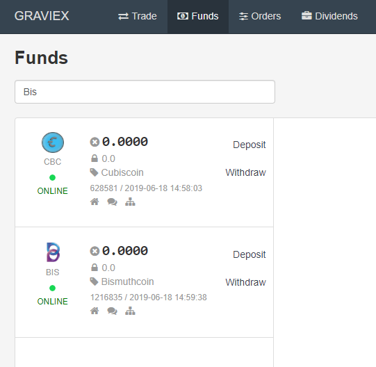
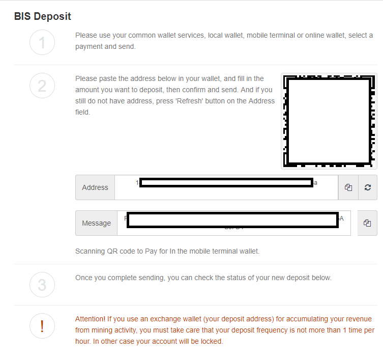
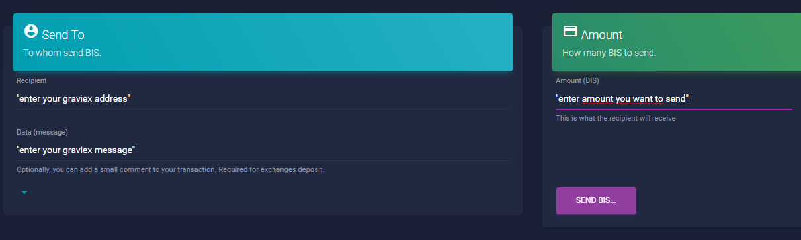
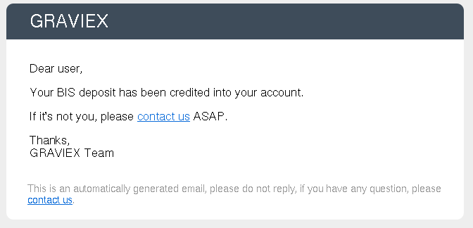

## How to deposit $BIS on graviex.net

Quick guide on how to deposit Bismuth coins on graviex.net exchange.

## Account setup

First of all you’ll need to create an account on [graviex.net](https://graviex.net), this is an easy step so I will skip it.   Second it is highly recommended for your account security to activate 2FA, so go for it. This should be also easy enough for you to set as it is a straight forward operation.  
Just hover over your account email(top right) **My Profile** and enable Two-Factor Authentication, scan the QR code with your mobile app and put the number from the app in the **Code** field.

## Deposit $BIS

Now since you have set up your account let’s move forward and see how you deposit Bismuth on the exchange.  
Click on "Funds" and then search for Bismuth or type "bis" in the search-field.

Click on **Deposit**.

Now from the Bismuth Deposit page you need to generate a new address. Click on the symbol right of the empty address-field. If you activated 2FA, you need to enter the actual auth-token from your mobile device.

> **Note:** Timing of 2FA may be more sensible than on some websites. Do not enter the code if you're close to start or end time.

If it seems that nothing happened try **shift+reload** (for example shift+F5). Your new address + the corresponding message should appear.

Open the Tornado wallet ([Download](https://github.com/bismuthfoundation/TornadoWallet/releases)), click on "Send" icon from the dashboard or from the transaction page and fill the **Recipient** field with your exchange address.  
Enter the message you got from graviex on **Data (message)**. Fill in the amount, you want to send and click **Send BIS**  

> Do not add the quotes, just address and message as given by Graviex.

You get a message if the transaction was successfully sent to mempool or you get an error-message (most likely, you forgot to enter the message from exchange). If you enter a wrong message, graviex is **not** able to connect your deposit to your account and your BIS is possibly lost, Tornado wallet can't check for wrong messages!

Done!

You'll get an email when your deposit arrives. It needs only 6 confirmations, so it's pretty fast.

## Important warnings

- You **need** to enter the message in "data/openfield" field when sending the transaction. The address is the same for everyone, message is mandatory.
- Means you **can not** directly mine to the exchange. Use a temp Tornado or Pawer wallet before sending to Graviex.
- Graviex asks that you do **not** deposit more than once an hour, or you risk your account locked. So, take care if testing with small amount first, wait for the next one.

## Withdraw $BIS 

Withdrawal of the $BIS coins is the same as on any other coin because you don’t need to enter a message since your address is unique. If you want to withdraw to another exchange, that requires a message, fill that message into the **message-field**.

## Happy trading!

***NOTE:***

1) If you have any issue please contact Graviex support at [graviex Support](<https://graviex.net/tickets>)  
2) Feel free to join us on Discord [Bismuth Discord](https://discord.gg/4tB3pYJ)
