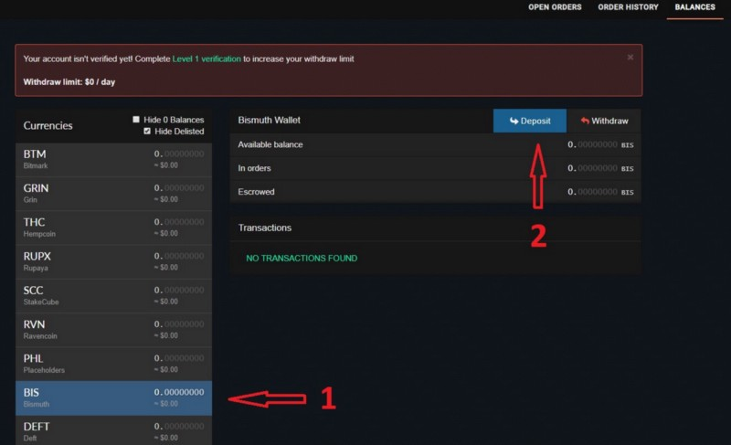
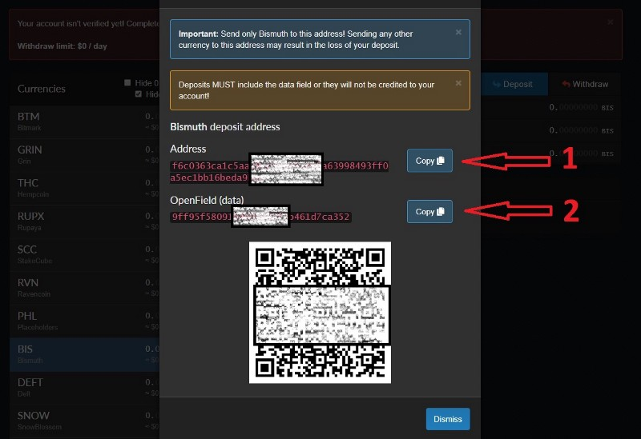

## How to deposit $BIS on qTrade.io

Quick guide on how to deposit Bismuth coins on qTrade.io exchange.

## Account setup

First of all you’ll need to create an account on [qTrade.io](https://qtrade.io), this is an easy step so I will skip it. Second it is highly recommended for 
your account security to activate 2FA, so go for it. This should be also easy enough for you to set as it is a straight forward operation. 
Just click on your account email(top right) **TWO FACTOR AUTH** -> **Enable** -> Scan the QR code with your mobile app and put the number from the
app in the **Code** field -> Hit **ENROLL**. That’s it!

## Deposit $BIS

Now since you have set up your account let’s move forward and see how you deposit Bismuth on the exchange. 
If you are familiar with Cryptopia deposit this should be pretty easy since is the same apart of few changed terms.

Under **BALANCES** find **BIS (Bismuth)** in the list on the left and click **Deposit**.

Now from the Bismuth Deposit page you’ll need 2 things. **1)** The **Address** and **2)** The **OpenField (data)**. Both are very important so the exchange 
to be able to track your deposit since their BIS address is the same for everyone.

From your personal wallet go to **Send** tab and fill the **Recipient** field with your exchange address from Point (**1**) put the BIS amount you want 
to send in the **Amount** field and the **OpenField(data)** from Point (**2**) in the **Data** field of your wallet like in the picture below:

Click **Send Bismuth**, check if everything is OK then hit **Confirm button**. Done!

## Withdraw $BIS 

Withdrawal of the $BIS coins is the same as on any other coin because you don’t need a OpenField(data) since your address is unique.

## Happy trading!

***NOTE:***

1) If you have any issues please contact qTrade.io support at [qTrade Support](https://qtradehelp.zendesk.com/hc/en-us/requests/new)
2) Feel free to join us on Discord [Bismuth Discord](https://discord.gg/4tB3pYJ)
