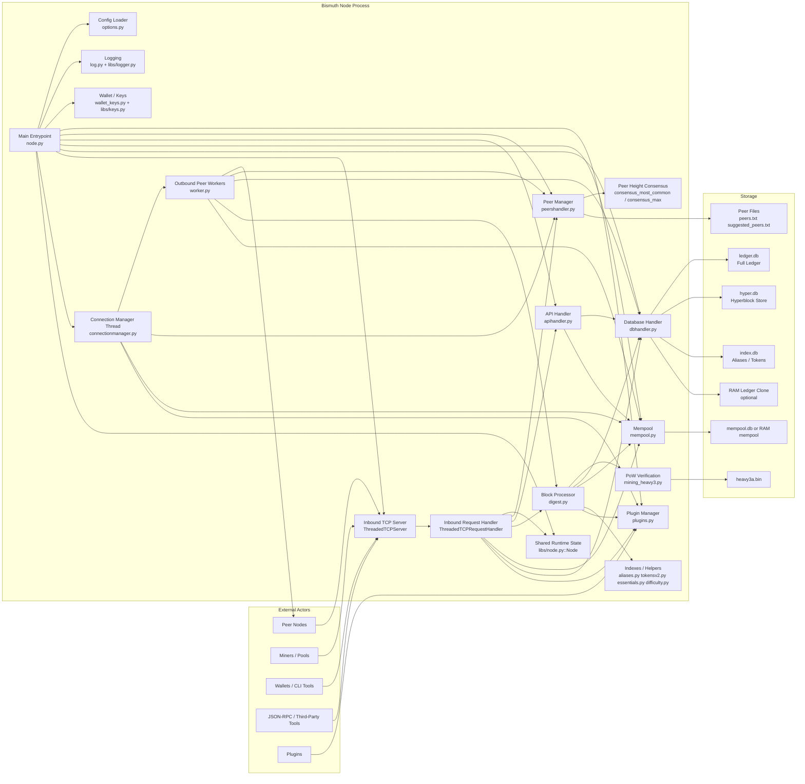
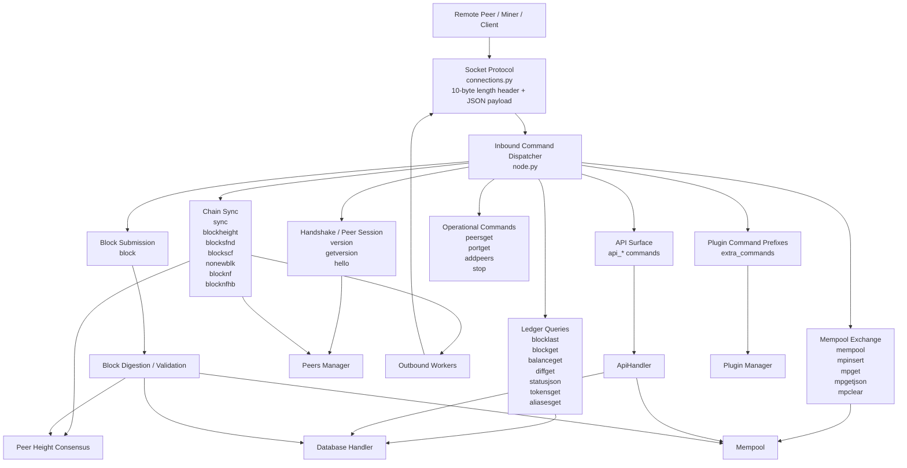
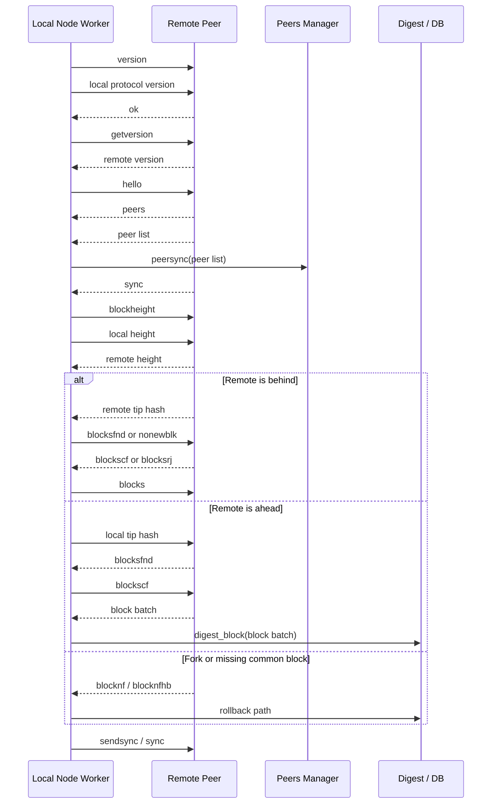
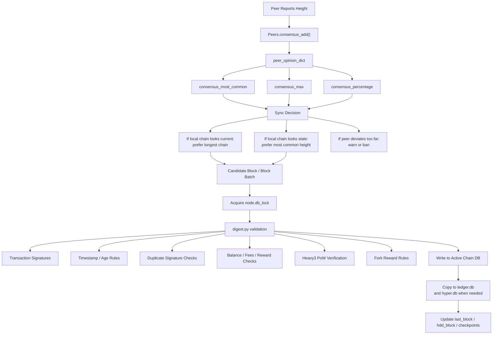
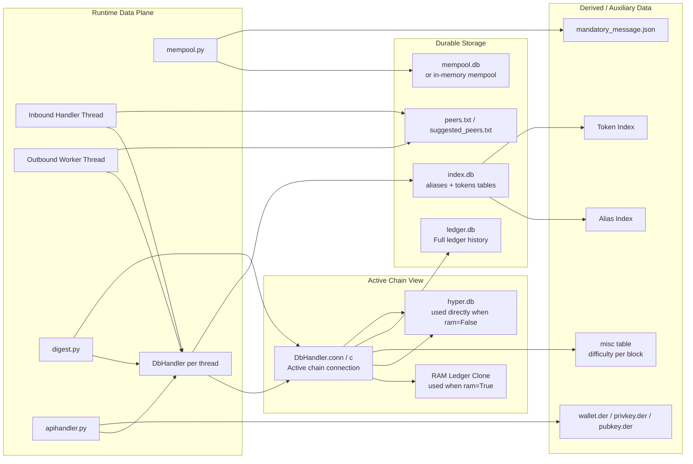
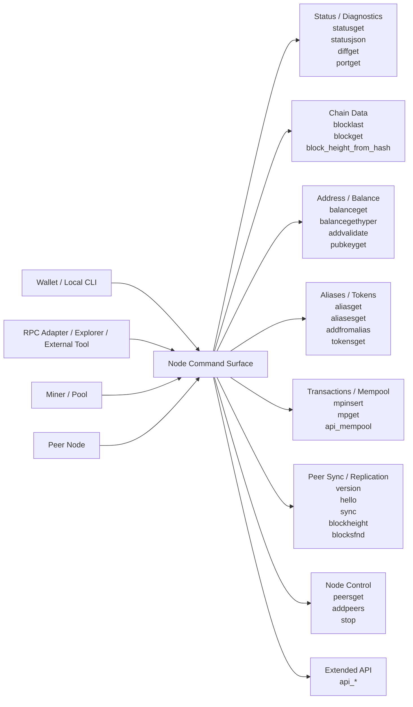

# Bismuth Main Node Diagrams

This document complements the written architecture notes with visual diagrams of the main Bismuth node, its protocol flows, and its ledger/storage topology.

## 1. Main Node Architecture

## 2. Protocol Architecture

## 3. Peer Sync Sequence

## 4. Consensus and Block Acceptance

## 5. Ledger and Storage Topology

## 6. External Interface Map

## 7. Reading Guide

Use the diagrams together:

- Diagram 1 shows the complete runtime component map.
- Diagrams 2 and 3 show how peers and clients talk to the node.
- Diagram 4 shows how peer opinions become block acceptance decisions.
- Diagram 5 shows where chain, index, and mempool data live.
- Diagram 6 shows the external command surface by functional area.
