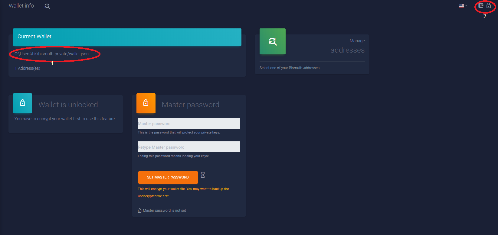

# How to Backup your private Keys/wallet

The new tornado wallet uses one file for storing private keys, public keys and addresses, just like the legacy tkinter python wallet. It is named **wallet.json**. You just have to backup this file to be safe. However, there are some differences:


### Where is wallet.json stored?

the tornado based wallet tells you, where it is storing your wallet.json (and also where you have to copy your existing .der-files, if you want to import them). For example the windows-path is:

```
c:\users\"username"\bismuth-private
```

If you start the wallet for the first time (or without a wallet.json in the wallets user path) you should see this screen:



The **red circle 1** shows your local path, where your wallet.json is stored. If this is not the first time you start the wallet, you can get to this screen by clicking the wallet-looking button upper right (**red circle 2**).

Navigate to the local path and copy the wallet.json to a safe place.

**Important:**

If you haven't set a master password, the file is not encrypted and can be used by everyone, that has access to it.

However, if you set a master password, the file is fully encrypted and you also need to remember the used master-password. Please also make a backup of the master password, if you think this is neccessary. 

**Loss of the master-password means loss of funds!**