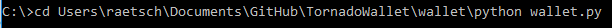
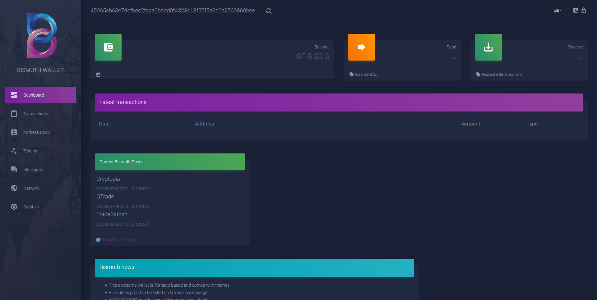
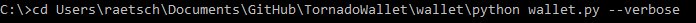
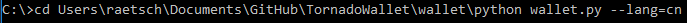

# Install on Windows

Several options are available:

## Option 1 - Install with Win-Installer (recommended):

Get the latest stable release from https://github.com/bismuthfoundation/TornadoWallet/releases

Download the `TornadoBismuthWallet-0.1.0-Installer.exe` and run it.  

After successful installation, go to the folder where you installed the wallet (standard path should be `C:\Program Files (x86)\TornadoBismuthWallet`) and start it with the **TornadoBismuthWallet.exe**.  
You can right-click the file and create a shortcut on your desktop or taksbar.

## Option 2 - Install the portable version

Get the latest stable release from https://github.com/bismuthfoundation/TornadoWallet/releases  
Portable version is `TornadoBismuthWallet-Win-0.1.0-portable.zip`  
Extract to a directory of your choice and run it from there.  It will install nothing more.

**Beware**: Your wallet still will be located in your user directory (the wallet will tell)

## Possible issues and solutions

### Older Win versions
The default install procedure is tested under Win10.  
Older win versions may show problem like: `program can't start because api-ms-win-crt-runtime-l1-1-0.dll is missing`.  
Install the missing DLL files from microsoft: https://www.microsoft.com/en-US/download/details.aspx?id=48145

### Anti Virus warnings?
Depending on your Anti virus, you may get a warning.  
As you can see on the release page, we ran the source code and source code with virustotal.
Because the wallet opens connections to the outside worlds, acts as a local webserver, or comes with an autoinstaller, some rare paranoid apps do consider it malicious. It is not, and you can run it from source if you want to.

## Option 3 - Install the wallet from source:
Under windows you can also run the Tornado wallet from the source-files.  
This is *not* the recommended way for new users.
You need python installed (preferably 3.7, minimum is 3.6) and then do:

clone it with a git tool or download a zip-file from (https://github.com/bismuthfoundation/TornadoWallet) , click the green "clone or download" - as zip.  
Extract it on your local pc, open a cmdline-window and navigate to the folder c:\your\selected\path\TornadoWallet and then type: 

`python -m pip install -r requirements.txt`

if you have not used a Bismuth-Wallet before, you need also pycryptodomex:
See https://pycryptodome.readthedocs.io/en/latest/src/installation.html#windows-from-sources-python-3-5-and-newer for help.
Follow the 3 steps on their documentation page.

if everything is installed, change dir to wallet and there start the TornadoWallet with:

`python wallet.py`

## Running the Wallet 

At program launch, a terminal gets opened -  you can ignore **BUT NOT CLOSE it!** There you see some Info for debugging and statistics and what the wallet does under the hood.  
This window will show the logs of the local webserver powering the wallet.  
It also opens a tab in your default browser: http://127.0.0.1:8888/wallet/info  
From here, you can select your local language (if available, otherwise it should be english).  
Default language setting is taken from your browser languages preferences.

### Options for wallet start

You can also start the wallet with some additional options:

Use `--verbose` if you want to see more CLI output, for example if something shows a weird behaviour, so you can add the message to a bug report.

If you do not want to start the wallet with your systems standard language, you can add `--lang=language_code`, for instance `--lang=de`for German.  
This will start the wallet with the selected language. It will start with english, if you enter an unknown abbreviation.  
If you used that switch to force a language, you will not be able to change the language from the browser.

It is also possible to start the wallet with `--debug` to get lots of information on the CLI.  
This is not recommended for normal users, but it also does no harm to the function itself.
