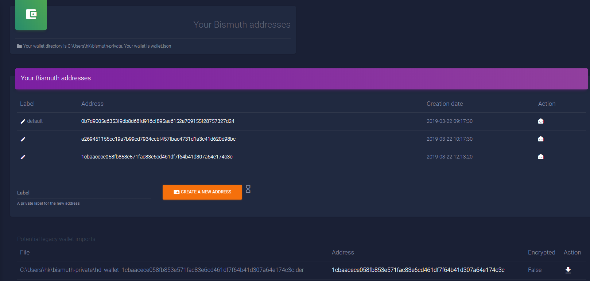
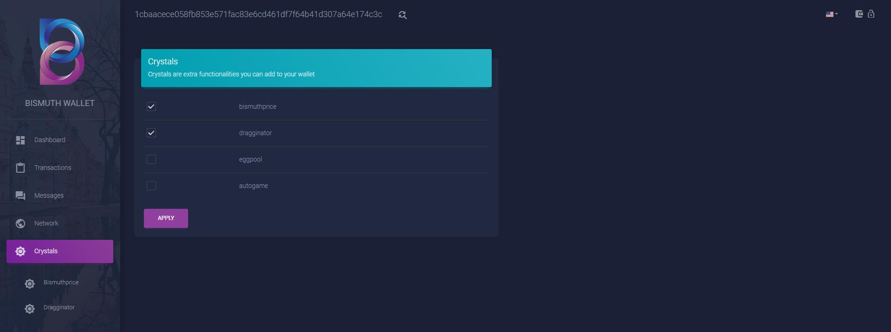

# Quickstart with your new wallet

You just installed the new tornado wallet, here are some tips how to start using it.

## First start

When you start the wallet, your default browser will open and show the following:

Let us notice some things. Left side is the navbar. A quick explanation of what we have there:

- [Dashboard](# dashboard): Quick overview for balance and last transactions, news. Also send and receive are there.  
  Some Crystals will also show up on dashboard, if activated (for example bismuthprice)
- [Transactions](# transactions): Here, Balance is shown, send, receive and your last 10 transactions
- [Messages](# messages): Here you can sign messages and in one of the next releases encrypt messages (Work in progress)
- [Network](# network): Here you can see detailed Infos like which server you are connected to as well as a list of available servers, network diff and block height
- [Crystals](# crystals): Addons that show additional info or add functionalities

Follow the links to get more details.

On top right of the main window, you can see the wallet-like sign with the lock.  
The lock shows your status, if you have a master password set (red for locked, transparent for unlocked like in the screenshot above)

## manage addresses

On top left, you see "wallet info", click on the looking glass to manage your addresses.

Here you can generate new addresses (up to 10 per wallet).  

You can generate labelled addresses or you can label addresses that don't have one yet.  
Click on the "pen"-button to edit labels.

If you click on an address or the "letter"-symbol under "Action" sets this address to **active-address**.  
The wallet will now show the related balance or transactions to this address. So if you want to change through your addresses, this can be done here.

## Import addresses

Many users will have existing private keys, that are stored in a .der-file format from the legacy wallet. It is possible to import them into the tornado-based wallet.

Copy your .der-files into the wallet directory, shown on top. It's the same directory as your wallet.json file.

After reloading the "manage addresses"-page, the wallet will show a list of files under **Potential legacy wallet imports**.

It shows the filename, the address it found in the file, encryption state and under "Action" the import button.

Clicking on "import" adds the address (and the matching keys) to the wallet.json file. So you do not have to import them every time you restart the wallet.

**Note:** The new wallet doesn't support encrypted legacy addresses yet.

## Dashboard

Once you selected an "active address", the Dashboard shows your balance, last transaction and you can send or receive BIS.

Remember, before you selected an active address, "Dashboard" showed you the screen to set a master password, or if you set one, that your wallet is locked and you need to unlock it.

Now you see the latest 3 transactions, your balance and you can send or receive BIS from here. The info about transactions is reduced, for full info, enter the transactions page.

## Transactions

Transactions shows the last 10 transactions you received or initiated yourself, with all details (txid, Date/Time, Address, Amount, Type, Fees and Data)

If you mouse over **Txid**, the txid of this transaction is shown. There is actually no way to copy it and paste it in a ticket or search for that id on explorer.  
The **Type** field shows the bismuth protocol operation, you performed with your transaction (this needs some more explanation and an additional faq-section for this will be added later). As a short explanation, type (operation field in legacy wallet) is used if you transfer token or other special functions.

In **Data**, you can add text as a note for yourself or the recipient. Some exchanges use data-field for an internal message-id that ***must*** be added to your tx, in order for the exchange to credit your funds to your account. Every Sign you add to the data field, raises the fee a bit.

## Messages

Messages is actually half work in progress. Signing messages is already working (for example needed for the dragginator game), but encrypting messages is not implemented yet.

For signing a message, just put the message you want to sign into the data field and click **sign message**. The text/data you put in gets now *signed* with your private key. When signing is finished, a popup-window with the result opens.

Signing messages does not mean **encrypted**. A recipient of this message can use your public key and be sure, the message is from you and not manipulated in any way.

## Network

On network page, you get some basic infos about the bismuth network and the wallet servers. 

The left side of the main window displays detailed infos about the wallet server you are currently connected to. This info can be very useful for the server admins, if you are facing problems in any way. So if you need help, try to provide this information too!

On the right side, you see the actual block and the mining difficulty of the Bismuth-Network. Below this, you have a list of available wallet servers.  
This list is generated by an API-call and you can refresh it by clicking **Refresh from API**. If you click on an **IP address**, the wallet will try to connect to this wallet server.  
At startup, the wallet tries to automagically selects the best possible wallet server for you. 

The displayed block height is also received from API. It represents the block, when the wallet servers where checked last time, so this will very often differ from actual block you see above. This is useful to diagnose a possible stuck wallet server (several blocks behind for instance).

## Crystals

Crystals are the tornado-based wallet equivalent for addons or plugins.

Actually, 4 addon already are integrated. If you activate them by clicking the checkbox, a submenu gets created, where you can see details of the addon.  
Some crystals are shown on dashboard (bismuthprice for instance), others are working in the page behind the link in the submenu (dragginator for instance).

Crystals will be explained in another section of the faq.

## Send BIS

If you want to sent BIS, you can use the "Send" icon from the dashboard or from the transaction page.

On the left side of the main window, you have to enter the address of the recipient. You can optionally enter data (a text message or in case of sending to some exchanges, the id, they gave you in their deposit dialogue).  
Another option, hiden behind the dropdown-arrow is a BIS Operation.

On the right side, you have to enter the amount of BIS to send. The wallet calculates the fee and shows the total value, that will be sent after you click on **send BIS**.

Last option is: You received a BIS-URL. Click the dropwdown-arrow, paste the BIS-URL and click **send BIS-URL**.

Whatever the option, clicking the "send" button will open the confirm dialog:

With **Confirm and send BIS**, your transaction will be broadcasted to the network, and you get the answer from the wallet server.

## Receive BIS

The receive page is used to create the formerly mentioned BIS-URL.

The page is similar to the send BIS one. Left side, ***your*** address is prefilled, because you want to create a BIS-URL to give to someone, so they can sent BIS to you. You can add data, that is also integrated into the BIS-URL.  
The qr-code represents just your address. You can copy the picture and leave or send it somewhere, instead of giving them your address.

On the right side you can enter the amount you want to receive.

After that, you click **Get BIS-URL** and it gets created. By clicking on the URL it is automatically copied and you can send or post it somewhere.

## Master Password

For improved security, you can set a master password (see on [Screenshot](# first-start) how it looks like). Setting one will encrypt your **wallet.json**.  
Losing your master password means losing all of your funds. Store it in a save place. Due to the added security, the wallet will get slower on some operations like creating a new address or editing a label.  
If you start a master-password-protected wallet, you have to unlock it first. Until you do so, no info - not even your addresses - is available.

## Spend Protection

When you added a **master password** you can add spend protection to your wallet. At the moment only PIN code is supported.

After you unlocked the wallet, you see a new field on the right part of the main window, called spend protection.  
You have to enter a PIN Code and your master password to activate the protection. You can also deactivate it later, if you want to.  
Once **Set spend protection** is activated, every operation needing your private key will need that PIN in order to be confirmed.

